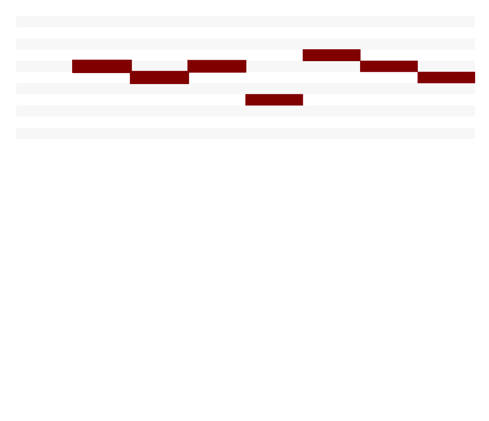

```{r setup, include=FALSE}
options(htmltools.dir.version = FALSE)
knitr::opts_chunk$set(
  fig.retina = 3,
  warning = FALSE,
  message = FALSE,
  echo = FALSE,
  fig.align = "center",
  fig.width = 10,
  fig.height = 6.25
)

library(tidyverse)
library(glue)
library(here)
library(forecast)
library(tseries)
library(TSA)
library(knitr)
library(xaringan)
```

```{r eval=FALSE, include=FALSE}
# Convert to PDF not working dimensionally
# library(webshot)
# file_name <- paste0("file://", normalizePath("slide-folder/assignment_1.html"))
# webshot(file_name, "assignment_1.pdf")

xaringan::decktape(file = "./slide-content/assignment_1.html", output = "assignment_1.pdf")

# https://github.com/astefanutti/decktape
# Convert deployed slides
system("docker run --rm -t -v `pwd`:/slides astefanutti/decktape https://goldbergdata.github.io/Big-Data-Platforms/#1 assignment_1.pdf")

# Convert local slides
system("docker run --rm -t -v `pwd`:/slides -v ~:/home/user astefanutti/decktape /home/user/slides.html slides.pdf")

# Local hosted file
system("docker run --rm -t --net=host -v `pwd`:/slides astefanutti/decktape http://localhost:8000 slides.pdf")
```

class: title-slide

<br><br>


# .title-slide-h1[Human + AI Music Generation]
### .title-slide-h2[An analytical approach to original music creation]
.title-slide-h3[Terry Wang, Rima Mittal, Joshua Goldberg]

.title-slide-h3[Research Design & Business Applications | Spring 2019]

---

class: text-slide, center, middle

# Business opportunity

--

.pull-left[


]

--

.pull-right[


]

---

class: text-slide

# Research Purpose

The purpose of this project is to develop a deep learning based music generator (instrumental music) which will help musicians and non-musicians alike to develop and refine musical ideas, and facilitate them in the music composition process. 

--

## Deliverable outline

--


* A GAN/Variational AutoEncoder music generation model either using a time series approach or another analytical method.


--


* A framework (genetic algorithm) to update weights/parameters of the model. We plan to have the human user choose k "good" samples from n generated samples for each iteration.


--


* A user interface where the user can interact with the model.

---

class: text-slide, center, middle

# Two key parts

.pull-left[


]

--

.pull-right[


]

---

class: text-slide

# Data and model description

--


* 130,000 midi files curated by a Reddit user, with a size of 3.65GB uncompressed. The collection has a great amount of variety representing all major genres in classical, jazz, metal, pop, etc.


--


* The generative algorithm will be of recurrent nature, where a snippet of monophonic midi track consisting of n number of quarter or $\frac{1}{16^\text{th}}$ notes will be fed at a time into a neural network of input matrix dimension $129 \times n$.


* This neural network will then output a matrix $129 \times 1$, which will be compared to the immediate next quarter or $\frac{1}{16^\text{th}}$ note of the input for back propagation. Thus, the model would take n quarter or $\frac{1}{16^\text{th}}$ notes as input to predict the immediate next note.


--


* The adversarial algorithm is a simple discriminator to find whether a given input is from one of the original training samples or not.


???

First bullet point: The music data we have is a collection of 130,000 music files. The Genres include: Pop, Classical (Piano/Violin/Guitar), EDM, VideoGame, Movie/TV Theme.

Second bullet: The length is yet to be determined and will be determined through experimentation

Last bullet: The length of the generated music is yet to be determined, but in theory we should be able to generate music of unlimited length given the recurrent structure.

---

class: text-slide

# Variables

Python libraries like __Music21__, __Librosa__, __PrettyMIDI__ are the toolkits we are using to extract meaningful information from our MIDI files. 

<br>

The stream object extracted using __Music21__ can then be used to identify:

* Instruments

* Key Signatures

* Overlaps

* Time Signatures

* Measures

From the measure, we were then able to identify:

* Notes

* Chord

???

We are also working with other metrics like the Pitch Histogram and other Composition Parameters Analysis.

---

class: text-slide

# Data structure example

```{r}
df <- read_csv(paste0(here(), "/sonic_df.csv")) %>% select(-1)

DT::datatable(df, options = list(pageLength = 1, dom = "tip"))
```

---

class: text-slide

# Visualizing model structure

.center[]

.footnote[Source: https://brangerbriz.com/blog/using-machine-learning-to-create-new-melodies]

---

class: text-slide

# To-date progress

--


* Gathered data and performed initial analysis


--


* Explored Google’s Magenta and explored Performance-RNN to generate some music


--


* Analyzed song structure with time series approaches (ARIMA, VAR, Markov)


---

class: text-slide

# Future work

--


* Build 2-3 variations of GANs and Variational Auto-encoders during the implementation quarter


--


* Work on specific Genre-based generation and also personalized music generation, sending out surveys and using preferences to adjust the model weights


---

class: text-slide

# Technical challenges

--


* Novelty of the project results in less formulated resources to rely on


--


* Determining a flexible model architecture to allow user feedback


--


* Collecting more data for training

---

class: text-slide

# Project Timeline

--


* Capstone Implementation in Autumn 2019


--


* Capstone Writing in Winter 2020


--


* Utilize the Summer Quarter(Vacation/Internship) for exploring 2-3 variations of GANs and Variational Auto-Encoders.

--


* Work on specific Genre based generation and personalized Music Generation in the Autumn Quarter.


